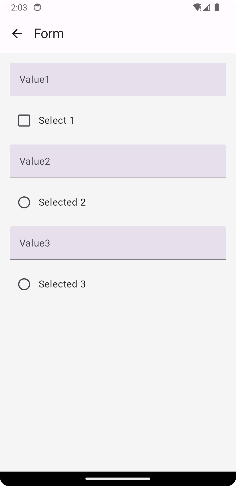

# Playground
Different ways in which compose works

## Focus
How compose behaves with focusable objects in a column and how it changes focus.
> keen interest in how it reacts to radiobutton or checkbox

| Screen                                                               | Expected                                                                                   |  Fix |
|----------------------------------------------------------------------|:-------------------------------------------------------------------------------------------|-----:|
|  | - checkboxes and radio buttons shouldn't be skipped when pressing next on the softkeyboard | 😂😂 |
